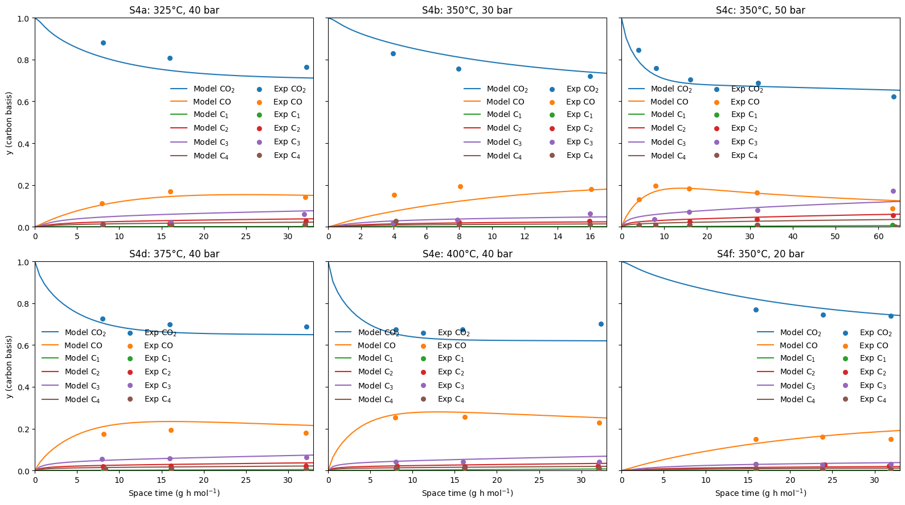
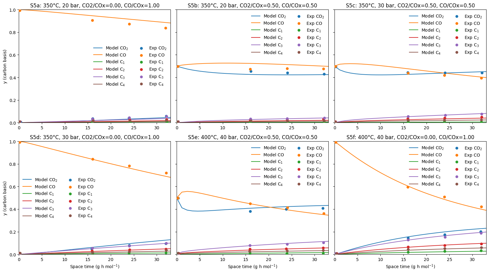

# Direct CO₂ Hydrogenation to Light Paraffins: Kinetic Model

Python implementation of a literature kinetic model for the direct hydrogenation of CO₂/CO to light hydrocarbons through methanol as intermediate via a bifunctional catalyst.

The model is based on:

> T. Cordero-Lanzac et al., **“A CO2 valorization plant to produce light hydrocarbons: Kinetic model, process design and life cycle assessment,”** *Journal of CO2 Utilization* 67 (2023), 102337.
> DOI: 10.1016/j.jcou.2022.102337

The repository is kept intentionally simple and follows the structure of the engineering calculation: equilibrium relations, reaction kinetics, packed-bed reactor model, validation data, and a Jupyter notebook demonstrating the complete workflow.

## Quick start

Install the required Python packages:

```bash
python -m pip install -r requirements.txt
```

The easiest way to explore the model is through:

```text
Model_Demonstration.ipynb
```

The notebook goes through the calculation step by step and allows the operating conditions and feed composition to be changed directly.

All validation and comparison figures can be regenerated with:

```bash
python reproduce_validation.py
```

The resulting figures are saved in `figures/`.

## Repository structure

```text
Direct-CO2-Hydrogenation-to-Paraffins-Kinetic-Model/
│
├── README.md
├── requirements.txt
├── Model_Demonstration.ipynb
├── reproduce_validation.py
│
├── model/
│   ├── equilibrium.py
│   ├── kinetics.py
│   └── reactor.py
│
├── data/
│   ├── S4a_325C_40bar_CO2.csv
│   ├── ...
│   └── S5f_400C_40bar_CO.csv
│
└── figures/
    ├── S4_validation.png
    ├── S5_validation.png
    ├── Figure5a_water_profile.png
    └── Figure5b_reaction_rates.png
```

The main calculation is contained in three Python files:

* `model/equilibrium.py` — temperature-dependent equilibrium constants
* `model/kinetics.py` — kinetic parameters, seven reaction-rate expressions and stoichiometry
* `model/reactor.py` — packed-bed reactor balance, feed preparation and result calculations

`Model_Demonstration.ipynb` provides a guided example of how these parts are combined.

## Reaction network

The model tracks ten species:

CO₂, H₂, CH₃OH, H₂O, CO, C₂H₆, C₃H₈, C₄H₁₀, CH₄ and He.

The kinetic network contains seven reactions:

1. **CO₂ hydrogenation to methanol**

   <p align="center">CO₂ + 3 H₂ ⇌ CH₃OH + H₂O</p>

2. **Reverse water-gas shift**

   <p align="center">CO₂ + H₂ ⇌ CO + H₂O</p>

3. **CO hydrogenation to methanol**

   <p align="center">CO + 2 H₂ ⇌ CH₃OH</p>

4. **CO methanation**

   <p align="center">CO + 3 H₂ → CH₄ + H₂O</p>

5. **Formation of C₂ paraffin**

   <p align="center">2 CH₃OH + H₂ → C₂H₆ + 2 H₂O</p>

6. **Formation of C₃ paraffin**

   <p align="center">3 CH₃OH + H₂ → C₃H₈ + 3 H₂O</p>

7. **Formation of C₄ paraffin**

   <p align="center">4 CH₃OH + H₂ → C₄H₁₀ + 4 H₂O</p>

The first three reactions contain thermodynamic equilibrium driving-force terms. The metal-function reactions include CO₂/H₂ adsorption terms, while the methanol-to-hydrocarbon reactions include inhibition by water.

The complete rate expressions and kinetic parameters are implemented in `model/kinetics.py`.

## Reactor model

The reactor is represented as a steady-state, isothermal and isobaric packed-bed reactor. Catalyst mass is used as the independent coordinate:

<p align="center"><i>dF<sub>i</sub> / dW = r<sub>i</sub></i></p>

where:

* *F<sub>i</sub>* = molar flow of species *i* [mol/s]
* *W* = catalyst mass [kg]
* *r<sub>i</sub>* = net formation rate of species *i* [mol/(kg<sub>cat</sub> s)]

The coupled species balances are integrated using `scipy.integrate.solve_ivp` with the BDF method.

The reactor model is implemented in `model/reactor.py`.

## Running a simulation

Operating conditions can be changed directly in `Model_Demonstration.ipynb`:

```python
TEMPERATURE_C = 350.0
PRESSURE_BAR = 40.0
SPACE_TIME = 24.0
CATALYST_MASS_G = 1.0

H2_OVER_COX = 3.0
CO2_FRACTION_IN_COX = 1.0
HELIUM_FRACTION = 0.2
```

The COx feed composition is defined through `CO2_FRACTION_IN_COX`:

```text
1.0   -> pure CO2
0.5   -> 50/50 CO2/CO
0.0   -> pure CO
```

The space time is defined as:

<p align="center"><i>τ = W / F<sub>COx</sub></i></p>

where *W* is the catalyst mass and *F<sub>COx</sub>* is the combined inlet molar flow of CO₂ and CO.

The notebook shows the inlet composition, reaction rates, reactor profiles, outlet composition and example validation results.

## Validation

The implementation was checked against the operating conditions and model results reported by Cordero-Lanzac et al.

Digitized literature-comparison data are available for the S4 and S5 validation cases and are stored in `data/`.

### S4 — CO₂ feed: influence of temperature and pressure



### S5 — influence of CO₂/CO feed composition



The corresponding operating conditions are:

| Case | Temperature | Pressure | COx feed     |
| ---- | ----------: | -------: | ------------ |
| S4a  |      325 °C |   40 bar | CO₂          |
| S4b  |      350 °C |   30 bar | CO₂          |
| S4c  |      350 °C |   50 bar | CO₂          |
| S4d  |      375 °C |   40 bar | CO₂          |
| S4e  |      400 °C |   40 bar | CO₂          |
| S4f  |      350 °C |   20 bar | CO₂          |
| S5a  |      350 °C |   20 bar | CO           |
| S5b  |      350 °C |   20 bar | 50/50 CO₂/CO |
| S5c  |      350 °C |   30 bar | 50/50 CO₂/CO |
| S5d  |      350 °C |   30 bar | CO           |
| S5e  |      400 °C |   40 bar | 50/50 CO₂/CO |
| S5f  |      400 °C |   40 bar | CO           |

The CSV files contain the digitized X/Y coordinates used for these comparisons. Their numerical values are preserved unchanged from the original implementation. They represent digitized reference data from the published figures, not original experimental raw measurements.

Two additional model results from the publication are also reproduced:

* `Figure5a_water_profile.png` — development of the water concentration along the catalyst bed
* `Figure5b_reaction_rates.png` — forward and reverse reaction-rate contributions for different COx feeds

All four figures can be regenerated with:

```bash
python reproduce_validation.py
```

## Model workflow

The calculation can be followed in the following order:

1. `Model_Demonstration.ipynb` — complete example calculation
2. `model/equilibrium.py` — equilibrium correlations
3. `model/kinetics.py` — kinetic parameters and reaction-rate equations
4. `model/reactor.py` — reactor balance and numerical integration
5. `reproduce_validation.py` — validation cases, literature data and plotting

The model files contain the complete calculation from operating conditions to reactor outlet and validation.

## Citation

If this implementation is used in academic or research work, please cite this repository as well as the original kinetic-model publication referenced above.

Citation metadata are provided in [`CITATION.cff`](CITATION.cff).

## License

The Python implementation in this repository is licensed under the GNU General Public License v3.0. See [`LICENSE`](LICENSE) for details.


